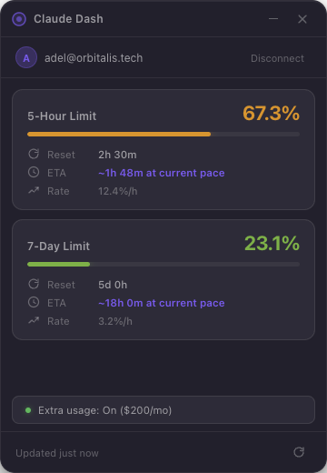

<p align="center">
  
</p>

<h1 align="center">Claude Dash</h1>

<p align="center">
  <strong>Know exactly when you'll hit the limit. Before you do.</strong>
</p>

<p align="center">
  <a href="#install">Install</a> &nbsp;&bull;&nbsp;
  <a href="#how-it-works">How it works</a> &nbsp;&bull;&nbsp;
  <a href="#features">Features</a> &nbsp;&bull;&nbsp;
  <a href="#build-from-source">Build</a> &nbsp;&bull;&nbsp;
  <a href="#support-this-project">Donate</a>
</p>

<p align="center">
  <a href="../../releases/latest"></a>
  <a href="../../releases/latest"></a>
  <a href="../../actions/workflows/ci.yml"></a>
  
  
  <a href="LICENSE"></a>
</p>

---

I kept getting rate-limited on Claude with zero visibility on when I'd hit the wall. No progress bar. No ETA. Just a sudden "you've reached your limit, come back later."

So I built this in one session. A tiny floating widget that reads your Claude usage in real-time, shows you exactly where you stand on every limit, and predicts when you'll run out based on your actual consumption speed.

Zero runtime dependencies. Zero config. Just install and it picks up your Claude Code session automatically.

---

## Install

Download the latest build for your platform:

<table>
  <tr>
    <td align="center"><strong>macOS</strong></td>
    <td align="center"><strong>Windows</strong></td>
    <td align="center"><strong>Linux</strong></td>
  </tr>
  <tr>
    <td align="center">
      <a href="../../releases/latest">
        
      </a>
      <br/><sub>Universal (Intel + Apple Silicon)</sub>
    </td>
    <td align="center">
      <a href="../../releases/latest">
        
      </a>
      <br/><sub>x64 / ARM64</sub>
    </td>
    <td align="center">
      <a href="../../releases/latest">
        
      </a>
      <br/><sub>x64 / ARM64 &nbsp;·&nbsp; .deb also available</sub>
    </td>
  </tr>
</table>

> **Prerequisite:** [Claude Code](https://docs.anthropic.com/en/docs/claude-code) installed and logged in. Claude Dash reads your existing session — no separate login needed.

## How it works

Claude Dash reads the OAuth tokens that Claude Code stores locally (`~/.claude/.credentials.json`), refreshes them silently, and polls the usage API every 5 minutes.

```
Claude Code login → ~/.claude/.credentials.json → Claude Dash reads tokens
                                                 → Polls /api/oauth/usage
                                                 → Displays limits + predictions
```

It shares tokens with Claude Code — both apps stay in sync. When you relaunch, it reconnects instantly without re-authentication.

## Features

**Real-time limit tracking**
- 5-hour rolling window utilization
- 7-day rolling window utilization
- Model-specific limits (Opus, Sonnet, Cowork) when active on your plan
- Extra usage status with monthly cap and spend tracking

**EWMA predictive engine**
- Estimates time-to-limit using Exponential Weighted Moving Average (15min half-life)
- Multi-horizon consensus: cross-checks rates over 10min, 30min, 1h, and 2h windows
- Acceleration-aware: detects if you're ramping up and biases toward the faster rate
- Confidence indicator: shows exact ETA (high), approximate ETA (medium), or "estimating..." (low)
- Reset-aware: automatically discards data from before a rolling window boundary

**Smart rate limit handling**
- Polls every 5 minutes (the usage API allows ~5 requests per token before 429)
- On 429: rotates the OAuth token (rate limit is per-token, new token = fresh counter)
- Exponential backoff with 15min ceiling on repeated errors
- Shares tokens bidirectionally with Claude Code — both apps stay in sync

**Two display modes**
- **Full view** (360 x 520px): detailed cards with progress bars, reset times, ETA, and consumption rate
- **Mini view** (280 x 120px): compact SVG ring gauges — one glance, zero reading. Toggle with a single click
- Both modes: frameless, always-on-top, dark glassmorphism with native macOS vibrancy
- Smooth number animations, color-interpolated progress (green to red), critical glow at 90%+

**Native notifications**
- macOS/Windows/Linux alerts at 80% and 95% thresholds
- De-duplicated per reset window (no spam)

**Zero friction**
- Auto-detects Claude Code credentials on launch
- Silently refreshes expired tokens (8h access / indefinite refresh)
- Persists window position across restarts
- No config files, no API keys, no setup wizard

## Tech

| | |
|---|---|
| **Runtime deps** | 0 |
| **Framework** | Electron 33 |
| **Renderer** | Vanilla HTML/CSS/JS |
| **Auth** | OAuth 2.0 PKCE (shared with Claude Code) |
| **Polling** | 5min interval, smart backoff + token rotation on 429 |
| **Storage** | Electron safeStorage (encrypted) |
| **Tests** | 38 Playwright E2E tests |
| **CI/CD** | GitHub Actions (macOS + Windows + Linux) |

## Build from source

```bash
git clone https://github.com/adelhelalpro-ai/claude-dash.git
cd claude-dash
npm install
npm start            # Run in dev mode
npm test             # Run 38 E2E tests
npm run dist         # Build for current platform
```

<details>
<summary><strong>Platform-specific builds</strong></summary>

```bash
# macOS DMG (Universal: Intel + Apple Silicon)
npx electron-builder --mac

# Windows NSIS installer (x64 + ARM64)
npx electron-builder --win

# Linux AppImage + .deb (x64)
npx electron-builder --linux
```

</details>

## Support this project

If Claude Dash saved you from rage-quitting a coding session, consider buying me a coffee:

| Network | Address |
|---------|---------|
| **BTC** | `bc1qqdlxs98e3fleely7dda39a0zg90k7uesgegnej` |
| **ETH** | `0xbCa8F43c5538Bc693E3cbe212D1D64C2c1b13e6B` |
| **SOL** | `B4FaXHEp5iv1bUUFR7PZMrUVy9aeeMEEa6WguutRQNJm` |
| **TRON** | `TYMiPoSGEfG58iCZgAVQoNdDygQN43fQhQ` |

## Work with me

I build tools that solve real problems. If you need someone who ships fast and thinks in systems, let's talk.

**[orbitalis.tech](https://www.orbitalis.tech)**

---

<p align="center">
  Built by <a href="https://www.orbitalis.tech">Adel Helal</a> &nbsp;&middot;&nbsp; MIT License
</p>
